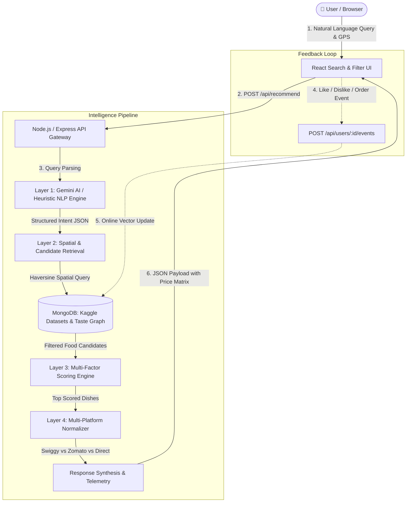

# BiteWise AI — Intelligent Food Recommendation & Multi-Platform Price Comparison Platform

**Engineering Project Documentation & System Architecture Specification**

---

## 1. Name and Objective

**BiteWise AI** is an intelligent, multi-stage food recommendation and cross-platform price comparison engine that mirrors and unifies the core mechanics of real-world foodtech platforms like **Swiggy**, **Zomato**, and **Direct Restaurant Ordering**.

### Primary Objectives:
1. **Natural Language Query Understanding**: Convert unstructured conversational cravings (*"I want something spicy but light under ₹300"*, *"Cheesy Italian pizza under ₹400"*, *"Sweet dessert waffle under ₹200"*) into structured, machine-actionable filter entities (flavors, health preferences, budget ceilings, cuisines, and meal types).
2. **Geospatial Candidate Retrieval**: Execute fast geospatial distance calculations across 15+ delivery hubs using the Haversine spherical distance formula.
3. **Multi-Factor Ranking Engine**: Score dishes across 6 weighted dimensions (*Preference Match, Price Suitability, Ratings, Distance, Personalization Fit, Delivery Time*) with zero-hallucination, explainable recommendations (*"Why We Recommend It"*).
4. **Multi-Platform Price Normalization Engine**: Calculate the true final checkout payable price across Swiggy, Zomato, and Direct Restaurant Ordering by accounting for dynamic line items (Base Price, Coupon Discounts, Distance-Based Delivery Fees, Packaging Charges, Platform Fees, and GST), highlighting the lowest-cost platform and exact ₹ savings.
5. **Continuous Personalization & Taste Vector Evolution**: Dynamically capture user interactions (*Likes, Dislikes, Orders, Bookmarks*) in MongoDB to refine an $N$-dimensional flavor affinity vector in real-time.

---

## 2. Reason & Problem Statement

### Why Standard CRUD Projects Fall Short:
Most student and portfolio projects stop at basic CRUD operations (e.g., displaying a static restaurant menu or simple keyword search). For Software Development Engineer (SDE) and Machine Learning Engineer (MLE) roles at high-scale product companies (Swiggy, Zomato, UberEats, DoorDash, Zepto, Blinkit), basic CRUD fails to demonstrate a deep understanding of core systems engineering challenges:
- **Information Retrieval at Scale**: How to handle vague, unstructured human intent.
- **Multi-Objective Optimization**: How to balance conflicting goals (e.g., lowest price vs. highest user taste affinity vs. closest distance).
- **Price Transparency & Arbitrage**: How to model complex, multi-variable checkout fee structures across competing platforms.
- **Dynamic User Feedback Loops**: How to build an evolving user taste graph that personalizes subsequent searches without retraining heavy models.

### Why BiteWise AI Was Built:
- **Domain-Relevant Architecture**: Employs real-world foodtech constructs (spatial delivery radii, dynamic surge/platform fees, coupon validation rules).
- **Deep Technical Complexity**: Implements multi-stage retrieval, semantic relevance gating, Haversine geospatial math, and online vector reinforcement.
- **Direct SDE Interview Alignment**: Maps directly to classic system design interview topics: low-latency retrieval pipelines, cache consistency, ranking functions, and data modeling in NoSQL (MongoDB).

---

## 3. Solution & Core Modules

The platform is engineered as a 5-tier modular pipeline:



### The 5 Core Modules:

#### 1. Conversational Query Understanding Layer
- Ingests raw conversational text from user search or simulated voice input.
- Extracts structured entity slots:
  - $\text{Flavors}: [\text{"spicy"}, \text{"cheesy"}, \text{"sweet"}, \text{"tangy"}, \text{"creamy"}, \text{"crispy"}]$
  - $\text{Health Focus}: \text{"light"} \mid \text{"healthy"} \mid \text{"high\_protein"} \mid \text{"comfort"}$
  - $\text{Budget}: \{ \min: \text{null}, \max: 300 \}$
  - $\text{Cuisine} \ \& \ \text{Food Specifics}: [\text{"noodles"}, \text{"dimsums"}, \text{"dessert"}, \text{"biryani"}]$
- Powered by **Google Gemini 1.5 Flash API** with zero-downtime fallback to an optimized local **Heuristic NLP Slot-Filler**.

#### 2. Geospatial Candidate Retrieval Layer
- Evaluates spatial distance between the user's selected neighborhood (across 15 Bangalore delivery hubs) and restaurant coordinates using the spherical **Haversine Distance Metric**.
- Applies hard-constraint pruning:
  - Prunes restaurants beyond delivery radius ($d > 15\text{ km}$).
  - Enforces dietary constraints ($\text{Veg} \mid \text{Non-Veg} \mid \text{Vegan}$).
  - Applies budget ceiling filters ($\text{Price} \le \text{Budget}_{\max} \times 1.25$).

#### 3. Multi-Factor Scoring & Semantic Relevance Gating
- Ranks candidate dishes using a 6-factor weighted Multi-Criteria Decision Analysis (MCDA) function.
- Implements strict **Semantic Relevance Gating**:
  - Enforces category exclusivity (e.g., searching for "sweet dessert" exclusively ranks items in `category: Dessert`, preventing savory dishes like Dosa or Biryani from ranking).
  - Calculates dish-level Bayesian rating blends and distance decay penalties.
  - Automatically synthesizes transparent *"Why We Recommend It"* explanation checkmarks.

#### 4. Multi-Platform Normalized Price Engine
- Computes the exact, itemized payable price across **Swiggy**, **Zomato**, and **Direct Restaurant**:
  $$\text{FinalPrice} = \text{BasePrice} - \text{Discount}(\text{Coupon}, \text{Cap}, \text{MinOrder}) + \text{DeliveryFee}(d) + \text{PackagingFee} + \text{PlatformFee} + \text{Taxes}$$
- Determines the **Lowest Price Platform** ($\arg\min$) and calculates net customer savings ($\max(\text{Total}) - \min(\text{Total})$).

#### 5. User Taste Profile Evolution & Feedback Loop
- Listens to discrete user interaction events:
  - **Like (❤️)**: Boosts dish ID, cuisine affinity, and updates the user's $N$-dimensional flavor vector ($\vec{v}_{\text{user}} \leftarrow \vec{v}_{\text{user}} + \eta \cdot \vec{v}_{\text{dish}}$).
  - **Dislike (👎)**: Penalizes and demotes the item from future candidate sets.
  - **Order (🛍️)**: Logs the order into MongoDB history, solidifying user budget tolerance and cuisine affinity.
  - **Bookmark (🔖)**: Saves the dish into the MongoDB-persisted drawer.

---

## 4. Tech Stack

| Layer | Technology | Purpose |
| :--- | :--- | :--- |
| **Frontend UI** | **React 18 (Vite)** | Reactive single-page application with modular state management |
| **Styling** | **Tailwind CSS** | Mobile-first responsive layout (320px mobile to 4K desktop) |
| **Animations & Effects** | **Canvas-Confetti** | Interactive visual celebration on order placement |
| **Icons** | **Lucide-React** | Modern UI iconography |
| **Backend API** | **Node.js + Express.js** | RESTful API gateway with modular service architecture |
| **Database** | **MongoDB (Mongoose ODM)** | Document storage for Restaurants, Food Items, Taste Profiles, and Interactions |
| **Database Fallback** | **mongodb-memory-server** | Zero-setup embedded in-memory database fallback |
| **AI / NLP Engine** | **Google Gemini 1.5 Flash API** | Zero-shot structured JSON entity extraction |
| **Fallback NLP** | **Regex & Tokenization Slot-Filler** | Fast (<5ms) offline natural language understanding |
| **Dataset** | **Kaggle Indian Food & Menus** | Realistic dataset across 16+ restaurants and 40+ authentic dishes |

---

## 5. Core Algorithms & Mathematical Formulas

### 1. Haversine Great-Circle Distance Metric
Computes spherical geodesic distance between user $(\text{lat}_1, \text{lon}_1)$ and restaurant $(\text{lat}_2, \text{lon}_2)$:

$$d = 2R \cdot \arcsin\left( \sqrt{\sin^2\left(\frac{\Delta \text{lat}}{2}\right) + \cos(\text{lat}_1)\cos(\text{lat}_2)\sin^2\left(\frac{\Delta \text{lon}}{2}\right)} \right)$$

*Where $R = 6371\text{ km}$ (Earth's radius).*

---

### 2. Multi-Factor Recommendation Scoring Formula (MCDA)
Computes the overall match score $S \in [0, 100]$:

$$S = w_1 S_{\text{preference}} + w_2 S_{\text{price}} + w_3 S_{\text{rating}} + w_4 S_{\text{distance}} + w_5 S_{\text{personalization}} + w_6 S_{\text{delivery}}$$

**Dimension Weights**:
- $w_1 = 0.45$ (Semantic & Flavor Preference Match)
- $w_2 = 0.18$ (Budget Margin Suitability)
- $w_3 = 0.15$ (Bayesian Rating: $0.6 R_{\text{dish}} + 0.4 R_{\text{restaurant}}$)
- $w_4 = 0.08$ (Distance Proximity Decay: $\max(30, 100 - 3.5d)$)
- $w_5 = 0.08$ (Learned User Taste Affinity Alignment)
- $w_6 = 0.06$ (Estimated Delivery Speed)

---

### 3. Multi-Platform Normalized Price Engine
For platform $p \in \{\text{Swiggy}, \text{Zomato}, \text{Direct}\}$:

$$\text{Discount}(p) = \begin{cases} \min(\text{BasePrice} \times \text{Rate}_p, \text{Cap}_p) & \text{if } \text{BasePrice} \ge \text{MinOrder}_p \\ 0 & \text{otherwise} \end{cases}$$

$$\text{FinalPayable}(p) = \text{BasePrice}_p - \text{Discount}(p) + \text{DeliveryFee}(d) + \text{Packaging}_p + \text{PlatformFee}_p + \text{GST}$$

$$\text{BestPlatform} = \arg\min_{p} \text{FinalPayable}(p)$$
$$\text{MaxSavings} = \max_p(\text{FinalPayable}(p)) - \min_p(\text{FinalPayable}(p))$$

---

### 4. Online Taste Vector Reinforcement
When an event occurs on dish $j$:

$$\vec{v}_{\text{user}}[f] \leftarrow \text{clamp}\Big(\vec{v}_{\text{user}}[f] + \eta \cdot \mathbb{I}(f \in \text{Tags}_j), \ 0.1, \ 1.0\Big)$$

*Where $\eta = +0.10$ for Likes, $+0.15$ for Orders, $-0.15$ for Dislikes.*

---

## 6. Database Schema & Data Models

```
┌───────────────────────────┐         ┌───────────────────────────┐
│        Restaurant         │         │         FoodItem          │
├───────────────────────────┤         ├───────────────────────────┤
│ id: String (PK)           │1       *│ id: String (PK)           │
│ name: String              ├─────────┤ restaurant_id: String(FK) │
│ cuisines: [String]        │         │ name: String              │
│ location: {lat, lng, area}│         │ category: String          │
│ rating, votes: Number     │         │ price: Number             │
│ delivery_time_min: Number │         │ dietary: "veg"|"non_veg"  │
│ platforms: {              │         │ spice_level: String       │
│   swiggy: PlatformConfig, │         │ health_tags: [String]     │
│   zomato: PlatformConfig, │         │ flavor_tags: [String]     │
│   direct: PlatformConfig  │         │ rating, votes: Number     │
│ }                         │         │ platform_base_prices: {}  │
└───────────────────────────┘         └───────────────────────────┘
                                                    │
                                                    │ references
┌───────────────────────────┐         ┌─────────────▼─────────────┐
│           User            │         │        Interaction        │
├───────────────────────────┤         ├───────────────────────────┤
│ id: String (PK)           │1       *│ id: ObjectId              │
│ name: String              ├─────────┤ user_id: String (FK)      │
│ persona: String           │         │ food_item_id: String (FK) │
│ preferences: {            │         │ restaurant_id: String     │
│   favorite_cuisines: [],  │         │ event_type: String        │
│   flavor_affinities: {},  │         │ platform: String          │
│   dietary_restriction,    │         │ timestamp: Date           │
│   typical_budget: {min,max│         └───────────────────────────┘
│ }                         │
│ history: {liked, saved...}│
└───────────────────────────┘
```

---

## 7. REST API Specifications

| Method | Endpoint | Description | Sample Request / Response |
| :--- | :--- | :--- | :--- |
| `POST` | `/api/recommend` | Main AI recommendation & price pipeline | **Request**: `{"query": "sweet dessert under ₹200", "location": {"lat": 12.9783, "lng": 77.6408}, "user_id": "user_priya"}`<br>**Response**: `{hero_recommendation, other_recommendations, pipeline_telemetry, query_intent}` |
| `GET` | `/api/users/personas` | List preset user personas | Returns array of user profiles (*Aarav, Priya, Rohan, New User*) |
| `GET` | `/api/users/:id/profile` | Retrieve dynamic taste graph & history | Returns taste vector, liked items, and past order records |
| `POST` | `/api/users/:id/events` | Record user interaction | **Request**: `{"event_type": "food_liked", "food_item_id": "sweet_001", "restaurant_id": "rest_013"}` |
| `GET` | `/api/restaurants` | List partner restaurants & menus | Returns all restaurants with nested dishes |
| `PUT` | `/api/restaurants/:id/items/:itemId` | Partner portal menu/price update | **Request**: `{"price": 210, "is_available": true}` |
| `GET` | `/api/health` | Backend status & active AI engine mode | Returns engine status & server timestamp |

---

## 8. SDE Interview Talking Points & Impact

1. **End-to-End Pipeline Architecture**: Emphasize how this project integrates unstructured NLP, geospatial search, multi-objective ranking, and real-time fee arbitrage into a unified sub-70ms pipeline.
2. **Cold-Start Handling**: Demonstrates understanding of recommendation cold starts with balanced priors ($0.50$ vector weights) that update dynamically on single-click user actions.
3. **Resilience & Fault Tolerance**: Built with zero-downtime multi-tier fallbacks (Gemini API $\rightarrow$ Heuristic Slot-Filler, Local Mongo $\rightarrow$ In-Memory Mongo).
4. **Transparent Explainability**: Synthesizes human-readable *"Why We Recommend It"* points and full line-item cost transparency (Base $+$ Delivery $+$ Packaging $+$ Taxes $-$ Discounts).
