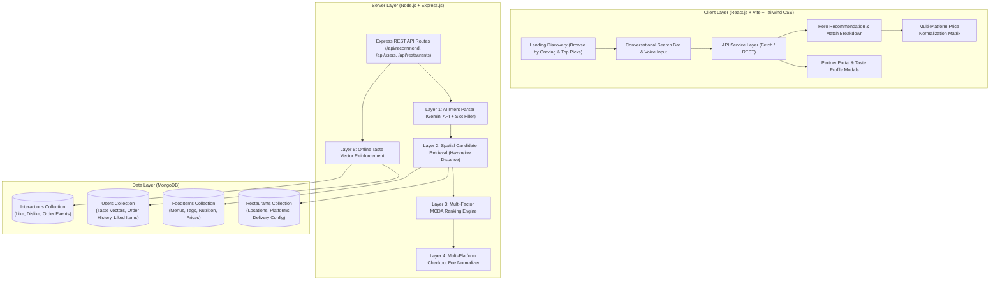

# BiteWise – Intelligent Food Discovery & Multi-Platform Price Comparison System

> A modern, responsive, full-stack food recommendation and cross-platform price normalization platform built with **React.js**, **Node.js**, **Express.js**, **MongoDB**, and **Google Gemini AI**.

---

## 📌 1. Project Overview & Problem Statement

### The Problem
When ordering food online, consumers face two major pain points:
1. **Dumb Keyword Search Bars**: Traditional delivery platforms only match exact dish names (e.g., *"Biryani"*). When users have natural conversational cravings (e.g., *"something spicy but light under ₹300"* or *"a rich sweet dessert"*), standard search fails to understand nutritional intent, flavor profiles, or budget constraints.
2. **Hidden Checkout Fees & Price Discrepancies**: The exact same dish from the same restaurant kitchen frequently costs significantly different amounts across **Swiggy**, **Zomato**, and **Direct Restaurant Ordering** due to dynamic surge pricing, variable delivery fees by distance, packaging charges, platform convenience fees, and platform-specific coupon rules.

### The Solution
**BiteWise** provides an intelligent, end-to-end food discovery and transparent price comparison engine:
- **Conversational Intent Extraction**: Translates unstructured cravings into structured query entities (*Flavors, Health Preferences, Budget Ceilings, Cuisines, Meal Types*).
- **Geospatial Candidate Retrieval**: Calculates spherical geodesic distances across 15+ delivery hubs using the **Haversine Distance Formula**.
- **6-Factor Multi-Criteria Decision Ranking**: Evaluates dishes across Taste Match, Budget Margin, Bayesian Rating Blends, Proximity Decay, Personalization Affinity, and Delivery Speed with explainable *"Why We Recommend It"* reasoning tags.
- **Multi-Platform Price Normalization Engine**: Calculates the true checkout payable total across Swiggy, Zomato, and Direct Restaurant Ordering, pinpointing the lowest-cost platform and exact ₹ savings.
- **Evolving User Taste Graph**: Updates user flavor affinities in MongoDB in real time through an online vector reinforcement loop on Likes, Dislikes, and Orders.

---

## 🚀 2. Key Features

### Consumer Experience & Intelligent Discovery
- **Natural Language Craving Search**: Search freely in conversational English or simulated voice input (e.g., *"sweet dessert under ₹200"*, *"spicy Hakka noodles & dimsums"*, *"crispy dosa under ₹150"*).
- **Interactive Landing Discovery**:
  - **Browse by Craving**: Category cards with authentic photo thumbnails (*Fresh Juices & Smoothies, Desserts & Waffles, Asian Noodles & Dimsums, North Indian & Naan, Sourdough Pizzas, Healthy Bowls, Street Food*).
  - **Top Picks Around [Location]**: Real-time popular dish showcase across 15+ Bangalore delivery hubs with ratings, restaurant names, and one-click price comparisons.
- **Multi-Factor Recommendation Engine**:
  - **Match Scoring (0–100%)**: Multi-Criteria Decision Analysis (MCDA) weighing flavor match (45%), price suitability (18%), rating quality (15%), distance proximity (8%), personalization (8%), and delivery time (6%).
  - **Strict Semantic Relevance Gating**: Prevents irrelevant fallbacks (e.g. querying for fresh juice strictly returns beverages and will not hallucinate an unrelated Dosa).
  - **Zero-Hallucination Guard**: Provides friendly, helpful empty-state suggestions when an unlisted dish is searched.
  - **Explainable Reasoning**: Synthesizes verified bullet points explaining why a dish matches the user's specific request.
- **15+ Bangalore Delivery Hubs**: Full geospatial support for Indiranagar, Koramangala, HSR Layout, MG Road, Whitefield, Jayanagar, JP Nagar, Malleshwaram, Church Street, and more.
- **Dynamic Taste Profile & Feedback Loop**:
  - **Like**: Boosts dish ID, cuisine affinity, and updates the user's $N$-dimensional flavor vector.
  - **Dislike**: Immediately demotes the item from future candidate sets.
  - **Order**: Simulates order placement with a celebration animation and logs the transaction into MongoDB history.
  - **Bookmarks / Saved Dishes**: Slide-out drawer to manage saved items.
- **Persona Switcher**: Seamlessly test personalization differences between presets (*Aarav: Spicy & Fitness Lover*, *Priya: Vegetarian & Sweet Foodie*, *Rohan: Budget Student Explorer*, *New User: Cold-Start Prior*).

### Multi-Platform Price Normalization Engine
- **Itemized Checkout Fee Matrix**: Computes true payable prices line-by-line:
  $$\text{Final Total} = \text{Base Menu Price} - \text{Validated Coupon Discounts} + \text{Distance Delivery Fee} + \text{Packaging Charge} + \text{Platform Fee} + \text{GST}$$
- **Side-by-Side Comparison**: Transparent matrix comparing **Swiggy vs. Zomato vs. Direct Restaurant**.
- **Arbitrage Optimization**: Computes $\arg\min$ payable cost, applies verified platform coupons (e.g. `ZOMATO50`, `SWIGGYIT`, `DIRECT5`), and displays exact customer savings (e.g. *"Save ₹42 on Direct"*).

### Restaurant Partner Portal (CMS)
- **Live Menu Management**: Restaurant managers can select their outlet, update base dish prices, and toggle in-stock / out-of-stock availability.
- **Instant Search Reflection**: Price and availability changes update immediately in database queries without application restarts.

---

## 🛠️ 3. Tech Stack

| Layer | Technologies |
|---|---|
| **Frontend** | React 18, Vite, Tailwind CSS, Lucide React, Canvas-Confetti, HTML5 |
| **Backend** | Node.js, Express.js, RESTful API architecture |
| **Database** | MongoDB, Mongoose ODM (Nested Document Schemas, Embedded Fallback via `mongodb-memory-server`) |
| **AI / NLP Engine** | Google Gemini 1.5 Flash API + Offline Heuristic Tokenizer & Slot-Filler |
| **Dataset** | Kaggle Bangalore Indian Restaurants & Menus (17 Restaurants, 46 Authentic Dishes) |
| **Environment** | dotenv, CORS |

---

## 📐 4. System Architecture



---

## 💻 5. Installation & Setup Instructions

### Prerequisites
- **Node.js** (v18+ recommended)
- **MongoDB** (running locally or MongoDB Atlas connection string — *fallback to embedded in-memory DB is automatic if local daemon is inactive*)
- **npm** or **yarn**

### 1. Clone & Enter Directory
```bash
git clone <repo-url>
cd "AI food recc"
```

### 2. Configure Environment Variables
Inside `backend/.env`:
```env
PORT=5001
MONGODB_URI=mongodb://127.0.0.1:27017/ai_food_recommender
GEMINI_API_KEY=your_gemini_api_key_here
NODE_ENV=development
```

Inside `frontend/.env` (optional, default proxy is port 5001):
```env
VITE_API_URL=http://localhost:5001/api
```

### 3. Install Dependencies
```bash
# Install backend dependencies:
cd backend && npm install

# Install frontend dependencies:
cd ../frontend && npm install
```

### 4. Start the Application
Run the backend and frontend in separate terminal windows:

**Terminal 1 (Backend Server):**
```bash
cd backend
node server.js
# Express API runs on http://localhost:5001
```

**Terminal 2 (Frontend Client):**
```bash
cd frontend
npm run dev -- --host
# Vite React app runs on http://localhost:3000
```

Visit **`http://localhost:3000`** in your browser to explore the platform!

---

## 📄 License
ISC License &copy; BiteWise Team.